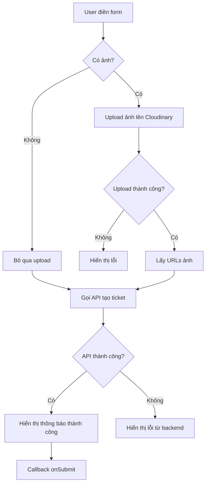

# Hướng dẫn Tích hợp API Tạo Ticket

## Tổng quan
Đã tích hợp API tạo ticket với các tính năng:
- ✅ Gọi API backend để tạo ticket
- ✅ Upload ảnh lên Cloudinary (hỗ trợ nhiều ảnh)
- ✅ Tiêu đề tự động lấy từ tên category
- ✅ Dropdown địa điểm với dữ liệu thực
- ✅ Xử lý lỗi và hiển thị thông báo

## Files đã tạo/sửa đổi

### 1. **src/services/imageUploadService.ts** (MỚI)
Service để upload ảnh lên Cloudinary:
- `uploadSingle(file)` - Upload 1 ảnh
- `uploadMultiple(files)` - Upload nhiều ảnh, trả về chuỗi URLs cách nhau bằng dấu phẩy
- `uploadFromDataUrls(dataUrls)` - Upload từ base64 data URLs

### 2. **src/services/ticketService.ts** (CẬP NHẬT)
Thêm method mới:
```typescript
async createTicket(data: CreateTicketRequest): Promise<CreateTicketResponse>
```

Request format:
```json
{
  "title": "string",
  "description": "string",
  "imageUrl": "string",        // URLs cách nhau bằng dấu phẩy
  "locationCode": "string",
  "categoryCode": "string"
}
```

### 3. **src/pages/student/create-ticket-page.tsx** (CẬP NHẬT)
Thay đổi chính:
- Tiêu đề tự động lấy từ `issueType.name` (read-only)
- Thay đổi `location` → `locationCode` (required)
- Thay đổi `images: string[]` → `imageFiles: File[]`
- Upload ảnh lên Cloudinary trước khi tạo ticket
- Hiển thị thông báo lỗi/thành công
- Xử lý async/await cho API calls

### 4. **src/types/index.ts** (CẬP NHẬT)
Thêm type definitions:
```typescript
export type IssueCategory = 'facility' | 'wifi' | 'equipment' | 'other';

export interface IssueType {
  id: string;
  name: string;
  category: IssueCategory;
  icon: string;
  description: string;
  examples: string[];
}
```

### 5. **.env.example** (CẬP NHẬT)
Thêm cấu hình Cloudinary:
```env
VITE_CLOUDINARY_CLOUD_NAME=your-cloud-name
VITE_CLOUDINARY_UPLOAD_PRESET=unsigned_preset
VITE_API_BASE_URL=https://localhost:7151/api
```

## Cấu hình Cloudinary

### Bước 1: Tạo tài khoản Cloudinary
1. Truy cập https://cloudinary.com
2. Đăng ký tài khoản miễn phí
3. Lấy **Cloud Name** từ dashboard

### Bước 2: Tạo Upload Preset (Unsigned)
1. Vào **Settings** → **Upload**
2. Scroll xuống phần **Upload presets**
3. Click **Add upload preset**
4. Cấu hình:
   - **Preset name**: Đặt tên (ví dụ: `ticket_images`)
   - **Signing Mode**: Chọn **Unsigned** ⚠️ QUAN TRỌNG
   - **Folder**: (Tùy chọn) Đặt folder để lưu ảnh, ví dụ: `tickets`
   - **Access mode**: Public (mặc định)
5. Click **Save**
6. Copy **Preset name**

### Bước 3: Cấu hình trong project
1. Copy file `.env.example` thành `.env`:
   ```bash
   cp .env.example .env
   ```

2. Cập nhật file `.env`:
   ```env
   VITE_CLOUDINARY_CLOUD_NAME=your-actual-cloud-name
   VITE_CLOUDINARY_UPLOAD_PRESET=ticket_images
   VITE_API_BASE_URL=https://localhost:7151/api
   VITE_USE_MOCK_DATA=false
   ```

3. Restart dev server để áp dụng env variables:
   ```bash
   npm run dev
   ```

## Luồng hoạt động



## Cách sử dụng

### 1. Tạo ticket với ảnh
```typescript
// Form data được submit với:
{
  title: "Hư hỏng cơ sở vật chất",      // Tự động từ category
  description: "Mô tả chi tiết...",
  locationCode: "P101",                  // Code của location
  imageFiles: [File, File, ...],         // Array of File objects
}

// Flow:
// 1. Upload imageFiles → Cloudinary
// 2. Nhận URLs: "url1,url2,url3"
// 3. Gọi API với data:
{
  title: "Hư hỏng cơ sở vật chất",
  description: "Mô tả chi tiết...",
  imageUrl: "https://cloudinary.../img1.jpg,https://cloudinary.../img2.jpg",
  locationCode: "P101",
  categoryCode: "facility-broken"
}
```

### 2. Backend nhận được
```json
{
  "title": "Hư hỏng cơ sở vật chất",
  "description": "Bàn ghế bị hỏng tại phòng 101",
  "imageUrl": "https://res.cloudinary.com/.../image1.jpg,https://res.cloudinary.com/.../image2.jpg",
  "locationCode": "P101",
  "categoryCode": "facility-broken"
}
```

Backend có thể split imageUrl bằng:
```csharp
var imageUrls = ticket.ImageUrl?.Split(',') ?? Array.Empty<string>();
```

## Xử lý lỗi

### 1. Lỗi upload ảnh
```typescript
if (formData.imageFiles.length > 0) {
  try {
    imageUrl = await imageUploadService.uploadMultiple(formData.imageFiles);
  } catch (error) {
    setSubmitError('Không thể upload ảnh. Vui lòng thử lại.');
    setIsSubmitting(false);
    return; // Dừng submit
  }
}
```

### 2. Lỗi API
```typescript
try {
  const response = await ticketService.createTicket({...});
  if (!response.status) {
    setSubmitError(response.message);
  }
} catch (error) {
  setSubmitError(error.message);
}
```

### 3. Hiển thị lỗi cho user
```tsx
{submitError && (
  <div className="mb-6 p-4 bg-red-50 border-2 border-red-200 rounded-lg">
    <div className="text-red-700 font-semibold mb-1">❌ Lỗi</div>
    <div className="text-red-600 text-sm">{submitError}</div>
  </div>
)}
```

## Testing

### 1. Test upload ảnh
```typescript
// Test trong console
const testFile = new File(['test'], 'test.jpg', { type: 'image/jpeg' });
const url = await imageUploadService.uploadSingle(testFile);
console.log('Uploaded URL:', url);
```

### 2. Test API tạo ticket
```typescript
const response = await ticketService.createTicket({
  title: 'Test Ticket',
  description: 'Test description',
  imageUrl: 'https://cloudinary.com/test.jpg',
  locationCode: 'P101',
  categoryCode: 'facility'
});
console.log('Response:', response);
```

### 3. Test form validation
- ✓ Tiêu đề (read-only, tự động)
- ✓ Mô tả (required)
- ✓ Địa điểm (required)
- ✓ Ảnh (optional, multiple)

## Lưu ý quan trọng

### 1. Security
- ⚠️ **Unsigned preset**: Dùng cho development/demo
- 🔒 **Production**: Nên dùng signed uploads với backend proxy
- 🔑 API keys không được expose trong frontend

### 2. Performance
- Compress ảnh trước khi upload (tối ưu hóa sau)
- Giới hạn kích thước file (hiện tại: không giới hạn)
- Loading state khi upload nhiều ảnh

### 3. UX
- ✅ Hiển thị progress khi upload
- ✅ Preview ảnh trước khi submit
- ✅ Có thể xóa ảnh đã chọn
- ✅ Thông báo lỗi rõ ràng

### 4. Backend Integration
Backend cần:
- Parse `imageUrl` string thành array
- Validate locationCode và categoryCode
- Xử lý case imageUrl empty
- Return đúng format response như đã define

## Cải tiến trong tương lai

1. **Upload optimization**:
   - Image compression
   - Progressive upload
   - Upload progress indicator

2. **Validation**:
   - File size limit (ví dụ: 5MB/file)
   - File type validation (chỉ image/*)
   - Maximum số ảnh (ví dụ: 5 ảnh)

3. **Error handling**:
   - Retry logic cho failed uploads
   - Partial success handling
   - Better error messages

4. **Security**:
   - Migrate to signed uploads
   - Backend proxy cho Cloudinary
   - Rate limiting

## Troubleshooting

### Lỗi: "Failed to upload image"
- ✓ Kiểm tra Cloud Name đúng chưa
- ✓ Kiểm tra Upload Preset có mode = Unsigned
- ✓ Kiểm tra network (CORS, firewall)

### Lỗi: "Request timeout"
- ✓ Ảnh quá lớn → compress trước
- ✓ Kết nối mạng chậm
- ✓ Tăng timeout trong .env

### Lỗi: API 400/500
- ✓ Kiểm tra format request
- ✓ Kiểm tra locationCode và categoryCode hợp lệ
- ✓ Check backend logs

## Contact & Support
Nếu có vấn đề, kiểm tra:
1. Console logs (F12)
2. Network tab trong DevTools
3. Backend logs
4. Cloudinary dashboard (Media Library)
